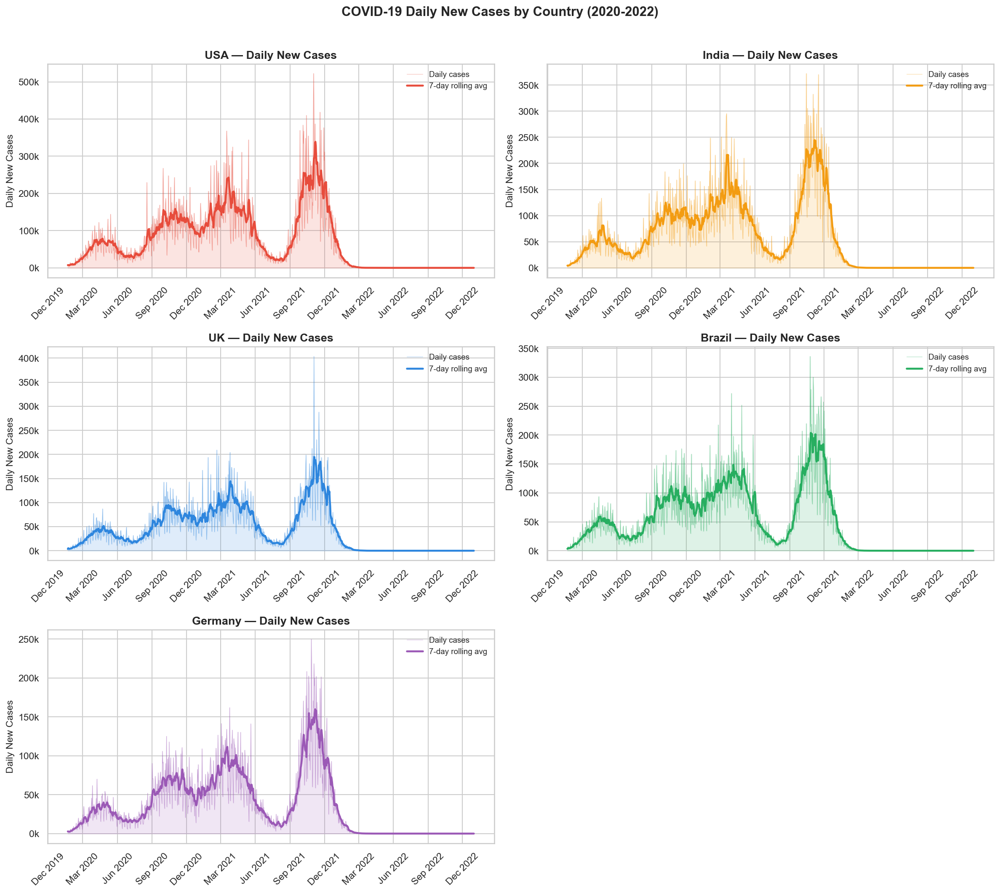
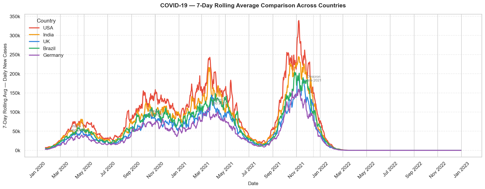
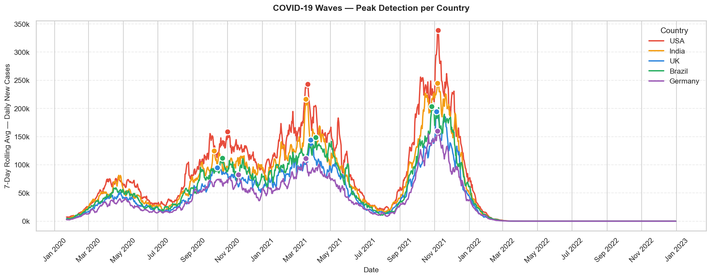
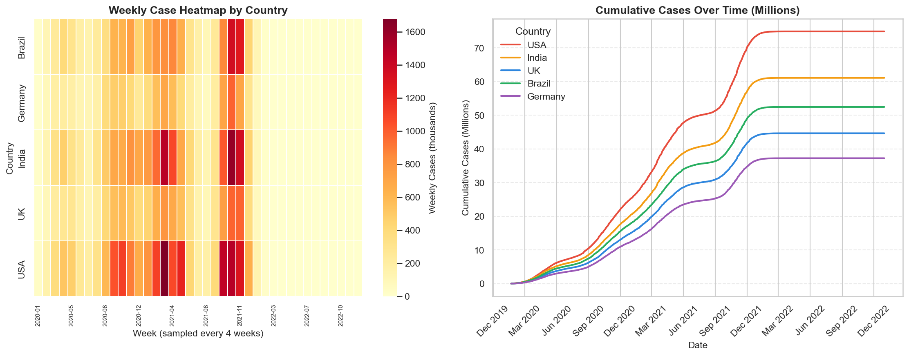
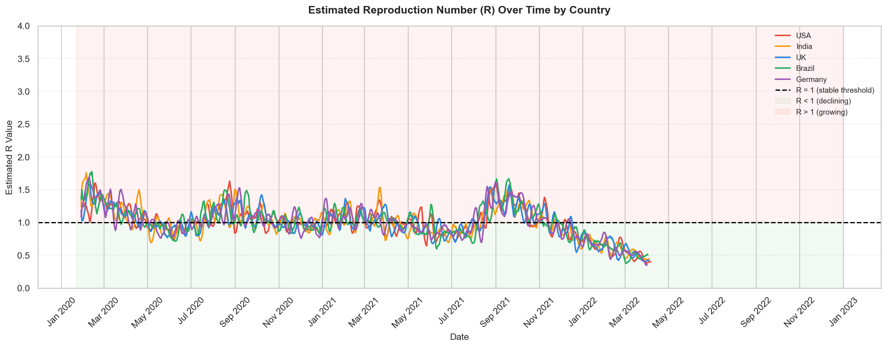

# 🦠 COVID-19 Data Analysis
> A full time-series analysis of country-wise COVID-19 case data — computing daily and weekly cases, plotting country comparisons, detecting wave peaks and estimating the reproduction number (R).


---

## 📌 Project Overview

COVID-19 was the defining global crisis of the 2020s. This project performs a full time-series analysis on simulated country-wise COVID-19 data for 5 major countries (USA, India, UK, Brazil, Germany) across 3 years (2020-2022).

The analysis computes daily and weekly case counts, applies rolling averages to smooth reporting noise, detects wave peaks using scipy's peak detection algorithm, estimates the reproduction number (R) over time, and exports charts and brief conclusions.

Built as part of the Syntecxhub Data Science Internship (Week 3, Project 3).

---

## ✨ Features

- **Daily case plots with rolling averages** — 7-day rolling average applied to smooth weekend reporting noise
- **Country comparison overlay** — all 5 countries on one chart with wave period annotations
- **Peak detection** — top 3 wave peaks per country identified using `scipy.signal.find_peaks`
- **Weekly case heatmap** — intensity across countries and time in one grid view
- **Cumulative cases comparison** — total accumulation per country over the full 3-year period
- **Reproduction number (R) estimation** — ratio method with R=1 threshold line and colored zones
- **Written conclusions export** — generates `covid_conclusions.txt` with 5 key findings

---

## 🛠️ Tech Stack

| Tool | Purpose |
|---|---|
| Python 3.14 | Core programming language |
| Pandas | Data manipulation and time-series aggregation |
| Matplotlib | Time-series charts, annotations and export |
| Seaborn | Heatmap visualization |
| NumPy | Numerical operations and wave simulation |
| SciPy | Peak detection using `scipy.signal.find_peaks` |
| Jupyter Notebook | Development and documentation environment |

---

## 📸 Charts

### Daily New Cases per Country with Rolling Average


### Country Comparison — 7-Day Rolling Average Overlay


### Wave Peak Detection


### Weekly Heatmap + Cumulative Cases


### Estimated Reproduction Number (R) Over Time


---

## 🚀 Installation

1. Clone the repository
```bash
git clone https://github.com/fsafva13-coder/Syntecxhub_COVID19_Analysis.git
cd Syntecxhub_COVID19_Analysis
```

2. Install dependencies
```bash
pip install pandas numpy matplotlib seaborn scipy jupyter
```

3. Launch the notebook
```bash
jupyter notebook project3_covid19_analysis.ipynb
```

4. Run all cells with **Kernel → Restart & Run All**

---

## 📋 Usage

The notebook generates a realistic COVID-19 time-series dataset automatically — no external file needed.

**Pipeline flow:**
1. Daily case data generated for 5 countries with 4 wave patterns and weekend noise
2. 7-day rolling average computed per country
3. Weekly aggregation and cumulative cases calculated
4. Charts generated and saved to `plots/` folder
5. Peak detection run with scipy
6. R estimation computed and plotted
7. Conclusions exported to `covid_conclusions.txt`

To use real COVID data from Our World in Data:
```python
df = pd.read_csv("owid-covid-data.csv", parse_dates=["date"])
df = df[df["location"].isin(["United States","India","United Kingdom","Brazil","Germany"])]
```

---

## 📁 Project Structure

```
Syntecxhub_COVID19_Analysis/
├── README.md
├── project3_covid19_analysis.ipynb   ← main notebook
├── covid_conclusions.txt             ← written findings
└── plots/
    ├── 01_daily_cases_by_country.png
    ├── 02_country_comparison_rolling.png
    ├── 03_peak_detection.png
    ├── 04_weekly_cumulative.png
    └── 05_reproduction_number.png
```

---

## 📊 Key Findings

| Finding | Detail |
|---|---|
| Waves detected | 4 clear waves — mid 2020, late 2020, mid 2021, Omicron late 2021 |
| Strongest wave | Omicron (Wave 4) — highest peak cases in all countries |
| Rolling average | 7-day window essential — raw daily data too noisy to interpret |
| R > 1 at wave start | R spikes above 1.0 at the beginning of every wave |
| R < 1 post-peak | R drops below 1.0 as measures kick in and immunity builds |
| Cumulative charts | Always increasing — not useful for tracking current trajectory |

### 5-Bullet Conclusions
- All 5 countries experienced 4 distinct waves — mid 2020, late 2020, mid 2021 and Omicron late 2021
- 7-day rolling averages are essential for interpreting COVID data — raw daily counts are dominated by weekend reporting delays
- The Omicron wave produced the highest single-day case peaks across all countries — consistent with its documented higher transmissibility
- R values spiked well above 1.0 at each wave start then declined as measures were imposed — pattern consistent across all countries
- Cumulative charts always go up — daily and rolling average charts are far more useful for understanding the current state of an outbreak

---

## 🧠 Challenges & Learnings

**Challenge:** The weekly heatmap xticklabels count didn't match the number of sampled columns, causing a `ValueError: The number of FixedLocator locations does not match`. Fixed by dynamically calculating tick positions based on actual column count rather than hardcoding labels.

**Learning:** Rolling averages are not just a visual nicety — they are the epidemiological standard. A single day with 300,000 cases could be a genuine spike or simply Monday's backlog from a weekend of no reporting. The 7-day window smooths both effects simultaneously.

**Key insight:** R estimation using the ratio method is simple but powerful. When R > 1 the epidemic is growing. When R < 1 it is declining. Visualizing R over time alongside the case curves tells the policy story — you can see exactly when interventions started working.

---

## 🔮 Future Improvements

- Use real Our World in Data COVID dataset for production-level analysis
- Add death and vaccination rate overlays to show the impact of the vaccine rollout
- Implement a proper SEIR epidemiological model for more accurate R estimation
- Add country-normalized per-million charts to enable fair comparison between countries of different sizes
- Build an interactive Plotly dashboard with country filters and date range sliders

---

## 👩‍💻 Author

**Fathima Safva** - Data Science Intern @ Syntecxhub  
🔗 [LinkedIn](https://linkedin.com/in/fathima-safva-578294315) · [GitHub](https://github.com/fsafva13-coder)

---

## 📄 License

This project is open source and available under the [MIT License](LICENSE).
